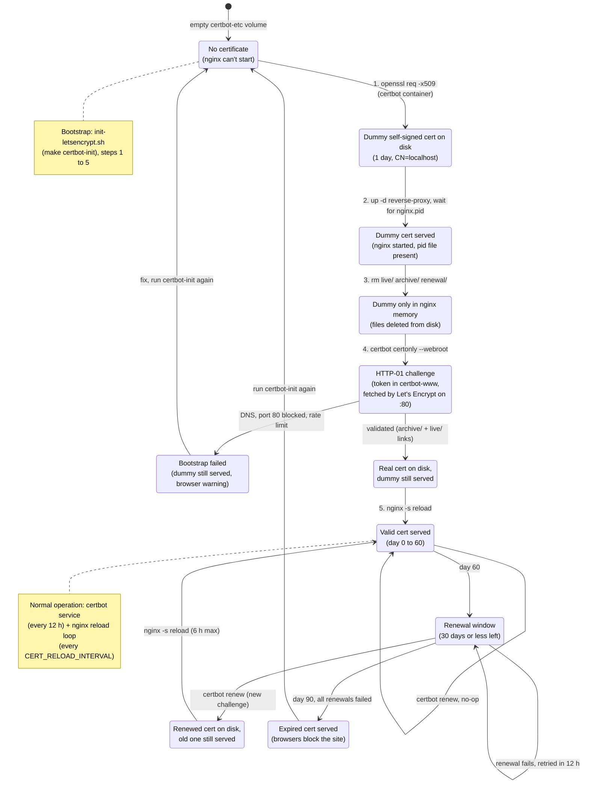

# Production deployment: Nginx + auto-renewed HTTPS (Let's Encrypt)

`docker-compose.prod.yml` is an **overlay** on top of `docker-compose.yml`:
it adds a public, TLS-terminating nginx reverse proxy and a Certbot renewal
loop, and changes nothing else. The base file stays dev-friendly; the
overlay is only used in production.

```bash
docker compose -f docker-compose.yml -f docker-compose.prod.yml <command>
# = $(PROD_COMPOSE) in the Makefile; the make prod-* targets wrap it.
```

## Contents

- [Architecture](#architecture)
- [Files](#files)
- [The services added by docker-compose.prod.yml](#the-services-added-by-docker-composeprodyml)
- [Nginx configuration](#nginx-configuration)
- [Certificate lifecycle](#certificate-lifecycle)
- [Configuration (.env)](#configuration-env)
- [One-time setup](#one-time-setup)
- [Day-to-day operations](#day-to-day-operations)
- [Troubleshooting](#troubleshooting)
- [Known limitations](#known-limitations)

## Architecture

```
                    ┌──────────────────── host ─────────────────────────────────────────┐
                    │                                                                   │
 Internet ──:80───▶ │ reverse-proxy (nginx:alpine)                                      │
          ──:443──▶ │   :80  → ACME challenge files, else 301 to https                  │
                    │   :443 → TLS termination ──http──▶ web:8080 (nginx, Angular SPA)  │
                    │                                      │                            │
                    │                                      └─/api/──▶ api:8000 (FastAPI) │
                    │                                                  │       │        │
                    │                                              db:3306  chromadb:8000│
                    │                                                                   │
                    │ certbot  (renewal loop, every 12 h)                               │
                    │   writes ─▶ [certbot-etc]  ◀─ reads (ro) ── reverse-proxy         │
                    │   writes ─▶ [certbot-www]  ◀─ serves (ro) ─ reverse-proxy         │
                    └───────────────────────────────────────────────────────────────────┘
```

- **Two nginx layers, two jobs.** `reverse-proxy` (this overlay) handles the
  internet side: TLS, HTTP→HTTPS redirect, HSTS, ACME challenges. `web`
  (`client/nginx.conf.template`, baked into the client image) serves the
  Angular build and proxies `/api/` to the `api` service. The app never deals
  with TLS: past `reverse-proxy`, all traffic is plain HTTP on the private
  `botfactory-network` Docker network.
- **Only `reverse-proxy` is reachable from outside.** `db`, `chromadb`, `api`
  and `web` publish their ports on `127.0.0.1` only (see
  `docker-compose.yml`), which is enough for debugging from the host itself.
  `reverse-proxy` reaches `web` by its service name on the Docker network,
  not through that published port.
- **Certificates live in named volumes**, shared between the two containers:
  `certbot-etc` (`/etc/letsencrypt`: keys, certificates, renewal config) and
  `certbot-www` (`/var/www/certbot`: HTTP-01 challenge files). Certbot writes
  to both; nginx mounts both read-only.

## Files

| File | Role |
|------|------|
| `docker-compose.prod.yml` | Overlay: the `reverse-proxy` and `certbot` services and the `certbot-etc` / `certbot-www` volumes. |
| `deploy/nginx/default.conf.template` | Public nginx config (`:80` and `:443` servers), rendered with `${DOMAIN}` at container start. |
| `deploy/nginx/40-reload-certificates.sh` | Startup hook of `reverse-proxy`: reloads nginx every `CERT_RELOAD_INTERVAL` so it serves renewed certificates. |
| `deploy/certbot/init-letsencrypt.sh` | One-time bootstrap: obtains the **first** certificate and gets `reverse-proxy` serving it. |
| `client/nginx.conf.template` | Inner nginx in the `web` image: SPA, static-asset caching, `/api/` proxy, security headers. |
| `Makefile` (`prod-*`, `certbot-init`) | Shortcuts for the commands below. |
| `.env` (repo root) | `DOMAIN`, `LETSENCRYPT_EMAIL`, `LETSENCRYPT_STAGING`, plus the app's own variables. |

## The services added by docker-compose.prod.yml

### `reverse-proxy`

| Setting | Value | Why |
|---------|-------|-----|
| Image | `nginx:alpine` | Stock image: the config is mounted, nothing is built. |
| Ports | `80:80`, `443:443` on all interfaces | The only public entry point. |
| Volumes | template (ro), reload script (ro), `certbot-etc` (ro), `certbot-www` (ro) | Read-only: nginx never writes certificates. |
| `DOMAIN` env | required (`${DOMAIN:?...}`) | Compose refuses to start without it, rather than rendering a config for an empty `server_name`. |
| `CERT_RELOAD_INTERVAL` env | default `6h` | How often nginx reloads to pick up renewed certificates (see [Certificate lifecycle](#3-serving-the-renewed-certificate)). |
| `depends_on` | `web` (started, not healthy) | Nginx resolves `web` at startup and fails if the name doesn't exist yet. |
| `restart` | `unless-stopped` | Comes back after a crash or a host reboot. |

The template is mounted in `/etc/nginx/templates/`: the `nginx:alpine`
entrypoint runs `envsubst` on every `*.template` there and writes the
result to `/etc/nginx/conf.d/` before starting nginx. `envsubst` only
replaces variables that exist in the container's environment (here
`DOMAIN`), so nginx's own variables (`$host`, `$scheme`, ...) are left
untouched. `client/nginx.conf.template` uses the same mechanism for
`${API_HOST}`.

The same entrypoint then runs the scripts in `/docker-entrypoint.d/`,
including the mounted `40-reload-certificates.sh`, which starts the
background reload loop described in
[Serving the renewed certificate](#3-serving-the-renewed-certificate).

### `certbot`

A long-running loop, not a one-shot job:

```sh
trap exit TERM; while :; do certbot renew --webroot -w /var/www/certbot --quiet; sleep 12h & wait ${!}; done
```

- `certbot renew` goes through every certificate in `/etc/letsencrypt/renewal/`
  and only renews those **expiring within 30 days**. Otherwise it does
  nothing, so running it every 12 hours costs nothing and is what Let's
  Encrypt recommends.
- `--webroot -w /var/www/certbot`: the HTTP-01 challenge. Certbot writes a
  token file to the shared `certbot-www` volume, and Let's Encrypt fetches it
  at `http://<DOMAIN>/.well-known/acme-challenge/<token>`, served by
  `reverse-proxy`'s `:80` server. No downtime, and no need to stop nginx.
- `sleep 12h & wait $!` (instead of a plain `sleep 12h`) together with
  `trap exit TERM`: `docker stop` sends SIGTERM, and the shell (PID 1) only
  acts on it while it is in `wait`. With a plain `sleep`, the container
  would ignore it and get killed after Docker's 10 s timeout.
- `$${!}` in the YAML is `${!}` escaped for Compose, which would otherwise
  try to interpolate it itself.
- This service **does not obtain the first certificate** (it only renews
  existing ones). `init-letsencrypt.sh` does that, see below.

## Nginx configuration

`deploy/nginx/default.conf.template`:

### `:80` server

1. `location /.well-known/acme-challenge/` serves files from
   `/var/www/certbot`. This is the HTTP-01 challenge, for both the first
   certificate and every renewal. It must stay on plain HTTP: Let's
   Encrypt starts the challenge on port 80.
2. `location /` returns `301 https://$host$request_uri` for everything else.

### `:443` server

| Directive | Value | Notes |
|-----------|-------|-------|
| `ssl_certificate` / `_key` | `/etc/letsencrypt/live/${DOMAIN}/fullchain.pem`, `privkey.pem` | `live/` holds symlinks to the latest version in `archive/`, updated by Certbot at each renewal. |
| `ssl_protocols` | `TLSv1.2 TLSv1.3` | TLS 1.0/1.1 disabled. |
| `ssl_ciphers` | ECDHE + AES-GCM / ChaCha20 only | Forward secrecy, AEAD ciphers (Mozilla "intermediate" profile). |
| `ssl_session_cache` / `_timeout` | `shared:SSL:10m`, `1d` | TLS session resumption: fewer full handshakes. |
| `client_max_body_size` | `20M` | Same limit as `web`, for PDF uploads (nginx's default is 1 MB). |
| `http2 on` | | HTTP/2 to browsers; the upstream hop to `web` stays HTTP/1.1. |
| `Strict-Transport-Security` | `max-age=63072000; includeSubDomains` | HSTS for 2 years. Browsers then refuse plain HTTP for this domain **and all its subdomains**, see [Known limitations](#known-limitations). |

`location /` proxies everything to `http://web:8080` with:

- `Host`, `X-Real-IP`, `X-Forwarded-For`, `X-Forwarded-Proto`: forward the
  original host, the client IP and the original scheme (`https`) past the
  TLS termination.
- `Upgrade` / `Connection "upgrade"`: allows WebSocket upgrades.
- `proxy_buffering off`: required for the SSE chat endpoints
  (`/api/rag/streamchat`, `/api/rag/trigfirstmessage`). With buffering on,
  nginx collects the whole response and sends it in one go, so answers no
  longer stream token by token. The inner nginx (`web`) disables buffering
  on `/api/` for the same reason. **Both hops must have it off.**

### Inner nginx (`web`), for reference

`client/nginx.conf.template` listens on `8080` and:

- serves the Angular build, with a `try_files ... /index.html` fallback for
  client-side routes; `index.html` is never cached, hashed assets are cached
  for 30 days;
- proxies `/api/` to `http://${API_HOST}:8000` (`API_HOST=api` in Docker),
  with buffering off (SSE);
- sets `client_max_body_size 20M` (PDF uploads), gzip, and the security
  headers `X-Frame-Options`, `X-Content-Type-Options`, `Referrer-Policy`.

## Certificate lifecycle

### State diagram

States of the certificate, from an empty `certbot-etc` volume to the
renewals. "On disk" = the files in `/etc/letsencrypt/live/<DOMAIN>/`;
"served" = what nginx holds in memory and presents to browsers.



### 1. First certificate: `init-letsencrypt.sh` (`make certbot-init`)

This is a chicken-and-egg problem: nginx won't start while the certificate
files in its config are missing, but Let's Encrypt needs a running nginx to
serve the challenge. The script solves it in 6 steps:

1. Loads `.env`, checks `DOMAIN` and `LETSENCRYPT_EMAIL`, and adds
   `--staging` if `LETSENCRYPT_STAGING=1`.
2. **Dummy certificate**: using the `certbot` image (which includes
   `openssl`), writes a self-signed, 1-day certificate to
   `/etc/letsencrypt/live/$DOMAIN/`, so nginx finds its files.
3. **Starts `reverse-proxy`** and waits (up to 30 s) until
   `/var/run/nginx.pid` exists, meaning nginx has actually loaded the dummy
   certificate. Deleting it before that point would leave nginx unable to
   start at all.
4. **Deletes the dummy certificate** (`live/`, `archive/`, `renewal/`), so
   Certbot doesn't mistake it for an existing certificate. The running nginx
   keeps it in memory.
5. **Requests the real certificate**: `certbot certonly --webroot` for
   `-d $DOMAIN`, RSA 2048, `--agree-tos --no-eff-email`.
   Let's Encrypt fetches the challenge on `:80`, which the running nginx
   serves.
6. **`nginx -s reload`**: nginx reloads its config and now serves the real
   certificate, with no downtime.

Before step 1, the script checks for `/etc/letsencrypt/renewal/$DOMAIN.conf`
(only written once Certbot has really issued a certificate). If it exists,
the script just starts `reverse-proxy` and exits, so `make prod-deploy` can be
re-run on every deploy without requesting a new certificate: Let's Encrypt
allows only 5 certificates per exact domain set per week. To request one
anyway (to switch from a staging to a production certificate, or after
changing `DOMAIN`), run `FORCE_CERT=1 make certbot-init`.

### 2. Renewal: the `certbot` service

Let's Encrypt certificates are valid for **90 days**. The `certbot` loop
checks twice a day and renews from **day 60** (30 days before expiry). It
reuses the settings from step 5 (webroot, email, key size), which Certbot
saved in `/etc/letsencrypt/renewal/$DOMAIN.conf`. The new files land in the
`certbot-etc` volume, and `live/` points to them.

### 3. Serving the renewed certificate

Nginx reads certificates **at startup and on reload only**. So
`reverse-proxy` reloads itself every `CERT_RELOAD_INTERVAL` (default `6h`):
`deploy/nginx/40-reload-certificates.sh`, mounted into
`/docker-entrypoint.d/`, starts a background loop running `nginx -s reload`
just before nginx starts.

- A reload is **graceful**: new workers start with the certificate read
  from disk, and old workers finish their open connections (streamed chat
  answers included) before exiting. Visitors notice nothing.
- If the config has become invalid, the reload fails, nginx keeps running
  with the previous config, and the error shows in `logs reverse-proxy`.
- Timing: renewal happens 30 days before expiry, and nginx serves the new
  certificate within 6 hours at most. It's in the logs as
  `reloading nginx to pick up renewed certificates` followed by
  `signal 1 (SIGHUP) received ... reconfiguring`.

To serve a renewed certificate right away:

```bash
docker compose -f docker-compose.yml -f docker-compose.prod.yml exec reverse-proxy nginx -s reload
```

## Configuration (.env)

In `.env` at the repo root (template: `.env.example`):

| Variable | Required | Used by | Meaning |
|----------|----------|---------|---------|
| `DOMAIN` | yes | `reverse-proxy`, `init-letsencrypt.sh` | Public FQDN (e.g. `bots.example.com`). Must already resolve to this server. |
| `LETSENCRYPT_EMAIL` | yes (bootstrap) | `init-letsencrypt.sh` | Contact address for Let's Encrypt (expiry and abuse notices). |
| `LETSENCRYPT_STAGING` | no | `init-letsencrypt.sh` | `1` = staging CA: certificates browsers don't trust, but much higher rate limits. For testing the setup. |
| `CERT_RELOAD_INTERVAL` | no (default `6h`) | `reverse-proxy` | Interval between nginx reloads (`sleep` syntax: `30m`, `6h`, `1d`). |
| `WEB_PORT` | no (default `8080`) | `web` | Loopback port of `web`. **Never `80` or `443`**: `reverse-proxy` needs those. |
| `GOOGLE_CLIENT_ID` | if Google sign-in is used | client + api | `https://<DOMAIN>` must be an authorized JavaScript origin of this OAuth client. |

## One-time setup

1. **DNS**: create an A (and/or AAAA) record for `DOMAIN` pointing to the
   server's public IP. It must already resolve, or the HTTP-01 challenge
   fails. Check with `dig +short <DOMAIN>`.
2. **Firewall**: only open 80 and 443 to the internet (e.g.
   `ufw allow 80,443/tcp`), plus SSH. The loopback-only bindings are a second
   line of defense, not a replacement. Note: Docker writes its own iptables
   rules for published ports, and these bypass `ufw`. This is exactly why the
   internal services are bound to `127.0.0.1`.
3. **`.env`**: set `DOMAIN` and `LETSENCRYPT_EMAIL` (and
   `LETSENCRYPT_STAGING=1` for the first attempt), and leave `WEB_PORT` alone.
   Also go over the app variables (`JWT_SECRET_KEY`, database passwords, LLM
   API keys; see `.env.example`).
4. **Google OAuth** (if `GOOGLE_CLIENT_ID` is set): add `https://<DOMAIN>` to
   the client's *Authorized JavaScript origins* in the
   [Google Cloud Console](https://console.cloud.google.com/apis/credentials).
   Otherwise Google Identity Services blocks the popup.
5. **Deploy**:
   ```bash
   make prod-deploy
   ```
   = `prod-build` (builds the images), then starts
   `db chromadb api web certbot` (everything **except** `reverse-proxy`,
   which has no certificate yet), then `certbot-init`.
6. **If you tested with staging**: remove `LETSENCRYPT_STAGING` from `.env`
   and run `make certbot-init` again to get the trusted certificate.

On first startup, `api` downloads its embedding model (~2.2 GB) before
reporting healthy (its healthcheck `start_period` is 10 minutes). The site
may answer 502 on `/api/` until then.

## Day-to-day operations

```bash
make prod-up      # start the whole stack (after the one-time setup)
make prod-down    # stop it (volumes, certificates included, are kept)
make prod-logs    # follow all logs
```

With `C="docker compose -f docker-compose.yml -f docker-compose.prod.yml"`:

| Task | Command |
|------|---------|
| Deploy a new version | `git pull && make prod-build && make prod-up` (only rebuilt/changed services are recreated) |
| List certificates and their expiry dates | `$C run --rm --entrypoint certbot certbot certificates` |
| Check the certificate actually served | `echo \| openssl s_client -connect <DOMAIN>:443 -servername <DOMAIN> 2>/dev/null \| openssl x509 -noout -dates -issuer` |
| Test renewal without renewing | `$C run --rm --entrypoint certbot certbot renew --dry-run --webroot -w /var/www/certbot` |
| Serve a renewed certificate right away | `$C exec reverse-proxy nginx -s reload` (otherwise automatic within `CERT_RELOAD_INTERVAL`) |
| Test the nginx config | `$C exec reverse-proxy nginx -t` |
| Proxy / renewal logs | `$C logs -f reverse-proxy`, `$C logs certbot` |
| Back up the certificates | `docker run --rm -v bot-factory_certbot-etc:/etc/letsencrypt -v "$PWD":/backup alpine tar czf /backup/letsencrypt.tgz -C /etc letsencrypt` |
| Back up the uploaded PDFs | `docker run --rm -v bot-factory_pdf_uploads:/uploads -v "$PWD":/backup alpine tar czf /backup/pdf_uploads.tgz -C / uploads` |

The `pdf_uploads` volume holds the PDFs attached to knowledges; back it up
with `mysql_data`, since the database references its files.

The `certbot-etc` volume holds the account key and the certificates. Losing
it isn't serious (`make certbot-init` gets new ones), but it counts against
the rate limits.

## Troubleshooting

- **`init-letsencrypt.sh` fails at "Requesting the real certificate"**:
  almost always either DNS not resolving to this server yet, or port 80
  unreachable from the internet (firewall, or the hosting provider's
  firewall). Check both before running it again: every failure counts
  against the rate limits.
- **"reverse-proxy did not start in time"**: `$C logs reverse-proxy`. The
  usual causes are `DOMAIN` missing or wrong, or port 80/443 already taken
  on the host (a host-level nginx or Apache, or `WEB_PORT=80`).
- **Rate limited** (`too many certificates already issued`): Let's Encrypt
  allows 5 identical certificates per week. Test with
  `LETSENCRYPT_STAGING=1`, and switch to production once everything works.
- **The browser shows an expired certificate even though `certbot
  certificates` shows a valid one**: the reload loop isn't running. Check
  that `$C logs reverse-proxy` contains
  `40-reload-certificates.sh: reloading nginx every ...` at startup. If it
  says `Ignoring ... not executable` instead, the script lost its exec bit
  (`chmod +x deploy/nginx/40-reload-certificates.sh`, then
  `$C up -d --force-recreate reverse-proxy`).
- **Renewal isn't happening**: `$C logs certbot`, then the `--dry-run`
  above. `certbot renew` does nothing until 30 days before expiry, so an
  empty log is normal.
- **`413 Request Entity Too Large` on uploads**: the file is over 20 MB,
  the limit set on both nginx layers (`client_max_body_size`).
- **Chat answers arrive all at once instead of streaming**: some hop has
  `proxy_buffering` on (`reverse-proxy`, `web`, or a CDN in front).
- **`docker ps` shows `80/tcp` or `443/tcp` on `botfactory-web` /
  `botfactory-certbot` with no arrow**: harmless. That's the `EXPOSE`
  inherited from their base images, only metadata. Only a
  `host:port->port` mapping (with an arrow) is a real published port.

## Known limitations

1. **Only one domain.** The certificate and `server_name` cover only
   `DOMAIN` (no `www.` variant). Supporting another name means adding it to
   `server_name` and a `-d` to `init-letsencrypt.sh`.
2. **HSTS with `includeSubDomains`, for 2 years.** Once a browser has seen
   this header, it refuses plain HTTP on **every** subdomain of `DOMAIN` for
   2 years. Check this before using a domain whose other subdomains serve
   HTTP-only sites.
