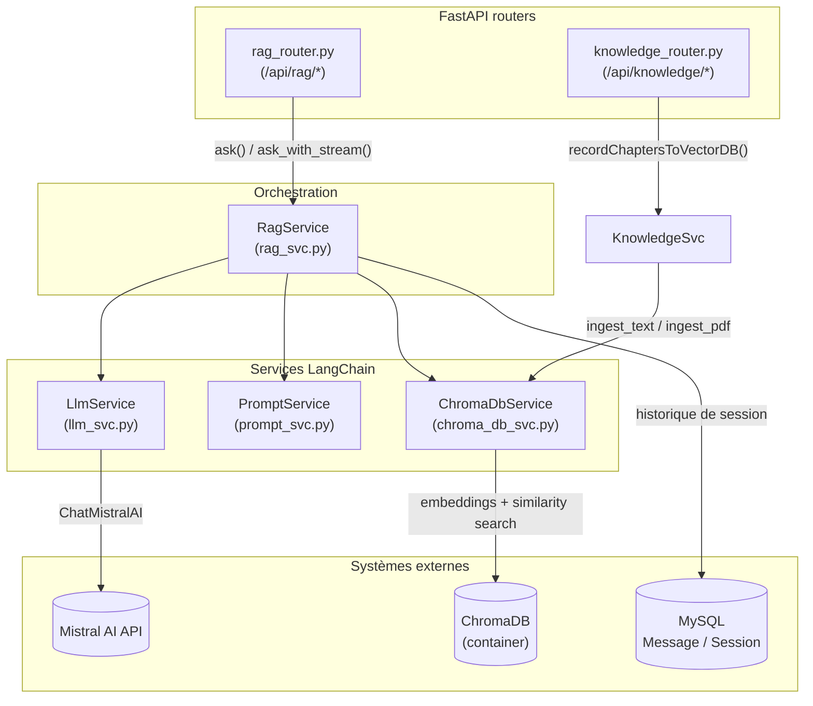
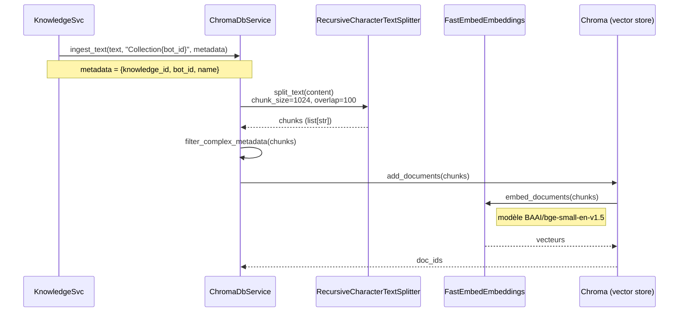
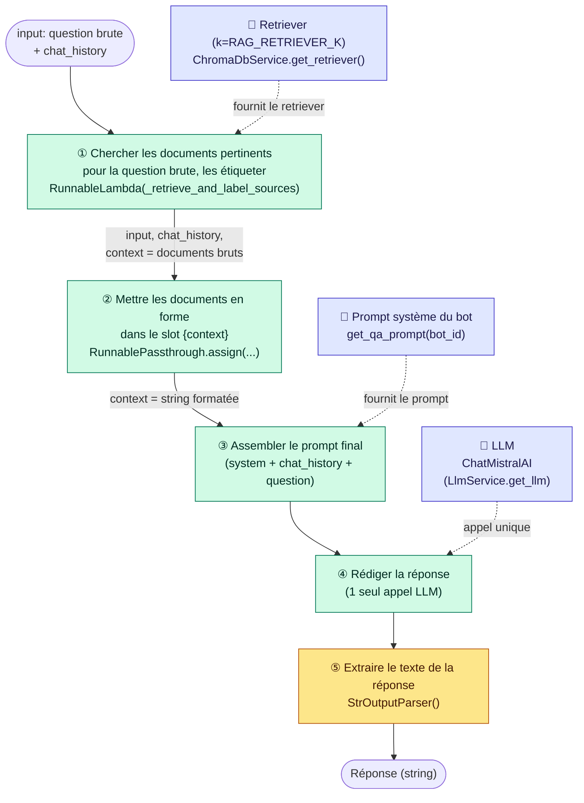
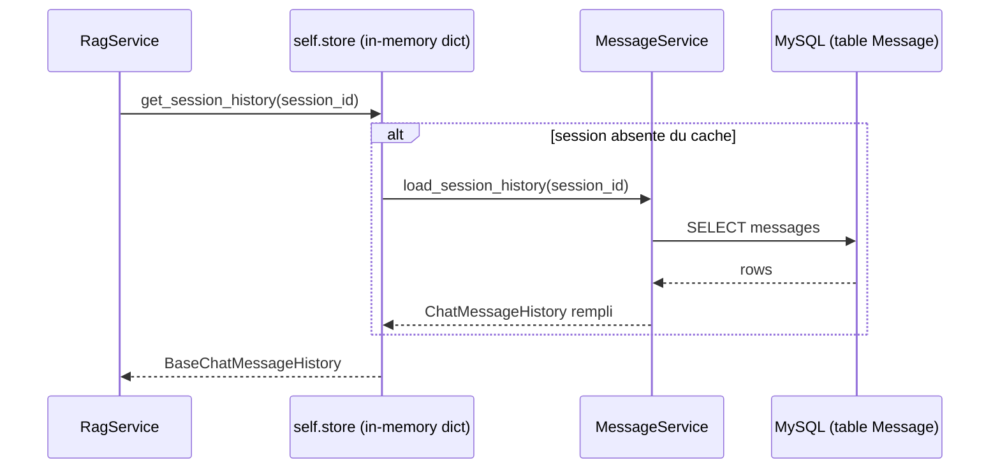
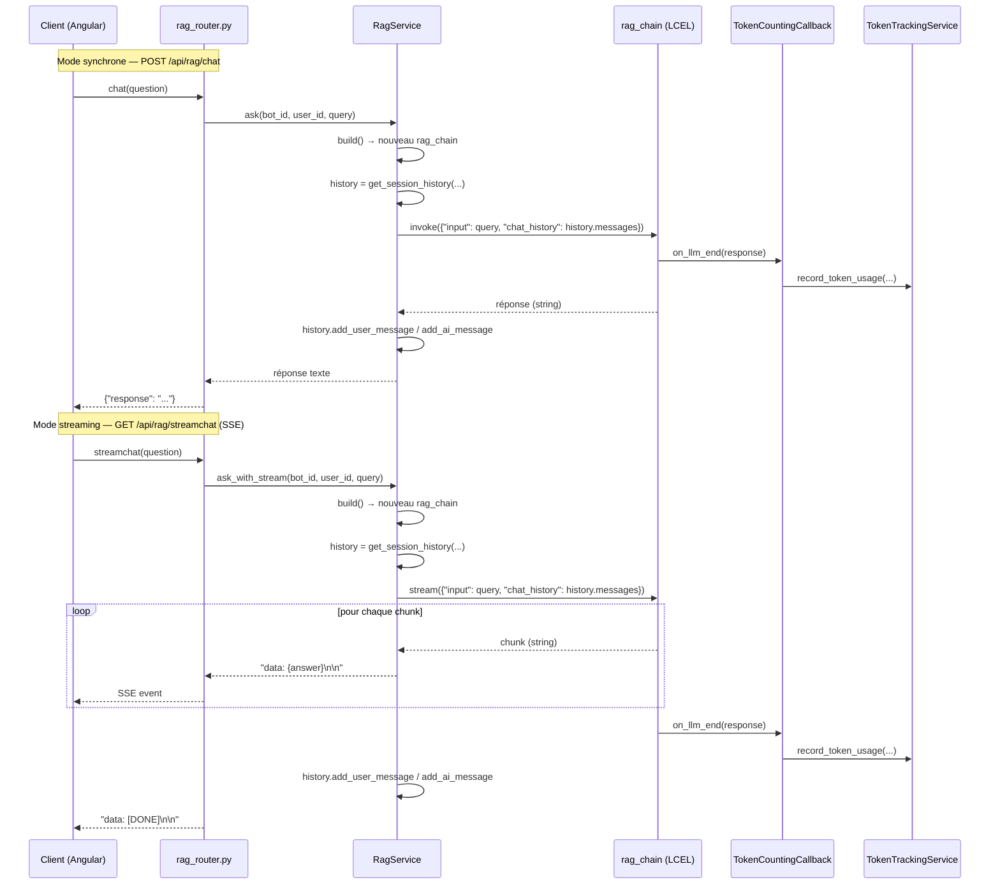
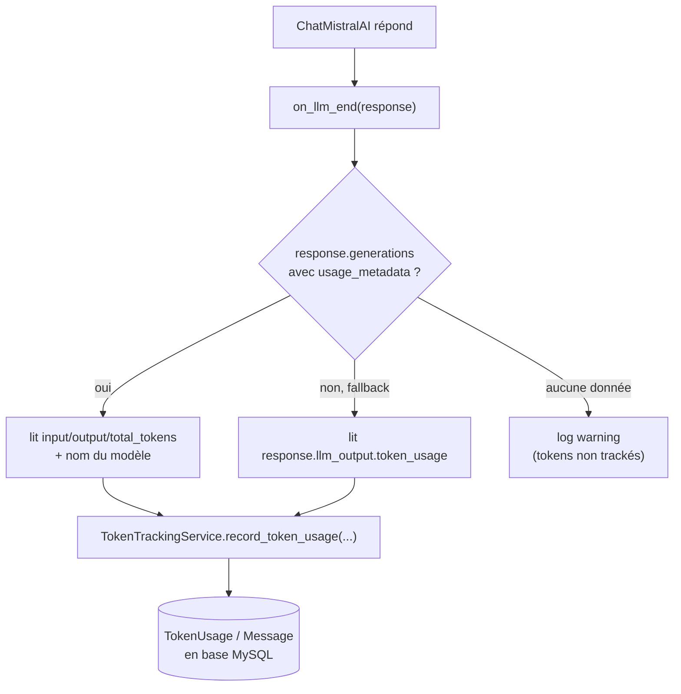

# Utilisation de LangChain dans Bot Factory

Ce document décrit où et comment [LangChain](https://python.langchain.com/) est utilisé côté
serveur, du chargement des documents jusqu'à la réponse du bot (avec ou sans streaming), en
passant par le suivi des tokens.

LangChain n'intervient que dans 4 services, tous dans `server/ai_server/services/` :

| Service | Rôle | Composants LangChain utilisés |
|---|---|---|
| `chroma_db_svc.py` | Ingestion et recherche vectorielle | `Chroma`, loaders de documents, text splitters, `FastEmbedEmbeddings` |
| `prompt_svc.py` | Construction des prompts | `ChatPromptTemplate`, `MessagesPlaceholder` |
| `llm_svc.py` | Accès au LLM + tracking tokens | `ChatMistralAI`, `BaseCallbackHandler` |
| `rag_svc.py` | Orchestration (pipeline RAG) | LCEL (`|`), `RunnableLambda`, `RunnablePassthrough`, `StrOutputParser` |

Le seul fournisseur LLM réellement branché aujourd'hui est **Mistral AI** (`ChatMistralAI`).
`llm_svc.py` importe encore `langchain_community.llms.Ollama` mais ne l'instancie nulle part —
import mort, à considérer comme tel plutôt que comme un second provider actif.

---

## 1. Vue d'ensemble des composants

---

## 2. Ingestion : du document texte/PDF aux vecteurs

Déclenchée quand une connaissance est créée/modifiée (`KnowledgeSvc._ingest_knowledge_node`)
ou en masse via `POST /api/rag/transmit_to_alfred/{bot_id}` (`recordChaptersToVectorDB`).

Points clés :
- Chaque chunk est taggué avec `knowledge_id` / `bot_id` / `name` dans ses métadonnées Chroma,
  ce qui permet de le retrouver et de le supprimer individuellement lors d'une resynchronisation
  (`sync_knowledge_to_vector_db`) sans devoir vider toute la collection du bot.
- Une collection ChromaDB par bot : `f"Collection{bot_id}"`.
- Les PDF passent d'abord par `PyPDFLoader` avant le même découpage/embedding.
- ⚠️ `chunk_size=1024` produit vite beaucoup de chunks pour un document réel (un simple PDF de
  26 pages en donne 48). Combiné à un `k` de retriever trop bas (voir §3), le bon chunk peut ne
  jamais être renvoyé au LLM alors qu'il est bien présent dans la base vectorielle.
- L'embedding (`BAAI/bge-small-en-v1.5`) est un modèle **anglais uniquement** — sur du contenu et
  des questions en français, les scores de similarité sont plus plats et discriminent moins bien
  le bon chunk des chunks non pertinents. Un modèle multilingue (`intfloat/multilingual-e5-large`,
  `BAAI/bge-m3`, ...) serait plus adapté à un cas d'usage francophone, mais changer de modèle
  nécessite de ré-ingérer toutes les bases de connaissances existantes (l'espace vectoriel change).

---

## 3. Construction de la chaîne RAG (`RagService.build`)

À chaque question, `RagService.build(bot_id, user_id, session_id)` **reconstruit et retourne**
un nouveau pipeline — il n'est jamais mis en cache ni stocké sur `self` : `RagService` est un
singleton partagé entre requêtes concurrentes, et chaque appel a besoin de son propre
`TokenCountingCallback` (lié à ce `user_id`/`bot_id`/`session_id`) attaché au LLM, donc réutiliser
un pipeline stocké sur l'instance risquerait de mélanger le tracking de tokens de deux requêtes
simultanées.

Contrairement à une version antérieure de ce document, le pipeline **n'utilise plus** les
fabriques `create_history_aware_retriever` / `create_retrieval_chain` /
`create_stuff_documents_chain` / `RunnableWithMessageHistory` de `langchain_classic` — trop
d'indirection pour ce que ça fait réellement. C'est une chaîne [LCEL](https://python.langchain.com/docs/concepts/lcel/)
simple, écrite à la main avec l'opérateur `|`, qui ne fait **qu'un seul appel LLM** par question
(au lieu de deux) : pas de passe de reformulation, la recherche vectorielle se fait directement
sur la question brute de l'utilisateur.

Ce qu'il faut retenir de ce schéma :

- **① `_retrieve_and_label_sources`** : interroge directement le retriever Chroma avec la question
  brute de l'utilisateur (pas de reformulation LLM), puis étiquette chaque extrait récupéré avec
  `Source: <nom du chapitre>` via `_label_documents_with_source`, à partir des métadonnées Chroma —
  uniquement pour la traçabilité affichée dans le prompt, jamais pour instruire le modèle (voir la
  note anti-prompt-injection dans `prompt_svc.py::update_prompt`). Le retriever renvoie les
  `RAG_RETRIEVER_K` chunks les plus proches par similarité cosinus (défaut : 12, configurable via
  `config.py`) — voir §2 pour pourquoi ce chiffre compte plus qu'il n'y paraît.
- **② `RunnablePassthrough.assign(context=...)`** : remplace la liste de documents par une seule
  string (`"\n\n".join(...)`) via `_format_docs`, tout en laissant passer `input` et `chat_history`
  inchangés — c'est l'équivalent LCEL du "stuff" de l'ancien `create_stuff_documents_chain`.
- **③-④ `qa_prompt | llm`** : le prompt système du bot (avec `{context}` rempli, plus le
  `MessagesPlaceholder("chat_history")` et la question `{input}`) est envoyé au LLM en un seul
  appel, qui rédige directement la réponse finale.
- **⑤ `StrOutputParser()`** : extrait le texte brut de la réponse du LLM (`AIMessage.content`) —
  le pipeline retourne donc directement une `string`, pas un dict `{"answer": ..., "context": ...}`
  comme avant (personne ne consommait la clé `context` en dehors de la chaîne elle-même).

Le compromis assumé : sans reformulation, une relance ambiguë du type "et pour lui ?" est
cherchée dans Chroma telle quelle plutôt que sous une forme reformulée et autonome — la pertinence
de la recherche peut en souffrir sur ce type de question, même si la réponse finale, elle, voit
toujours tout `chat_history` (§4). Le `TokenCountingCallback` (§6) n'est donc plus déclenché
qu'**une seule fois par question**, au lieu de deux.

L'historique de conversation (`chat_history`) n'est plus injecté/persisté automatiquement par une
enveloppe LangChain : `ask()`/`invoke_and_save()` et `ask_with_stream()` appellent maintenant
`get_session_history(session_id)` (§4) explicitement avant d'invoquer le pipeline, puis
`history.add_user_message(...)` / `history.add_ai_message(...)` juste après avoir obtenu la
réponse.

---

## 4. Historique de conversation

`get_session_history` maintient un cache en mémoire (`self.store: dict`) de
`BaseChatMessageHistory` par `session_id`, initialisé depuis MySQL via `MessageService` au
premier accès (`load_session_history`) :

⚠️ Les deux points d'entrée du chat n'utilisent pas la même clé de session :
- `ask()` (chat non-streamé) invoque la chaîne avec `session_id = f"{bot_id}_{user_id}"`.
- `ask_with_stream()` (SSE) invoque la chaîne avec `session_id = f"Collection{bot_id}"`
  (le nom de la collection Chroma, sans le `user_id`).

Chaque chemin a donc sa propre entrée dans `self.store`/l'historique en mémoire process ; c'est
un détail d'implémentation existant à garder en tête si l'historique semble "sauter" en passant
du mode streamé au non-streamé.

---

## 5. Deux modes d'appel : synchrone et streaming (SSE)

Dans les deux cas, la question de l'utilisateur et la réponse finale du bot sont persistées via
`MessageService.save_message` (rôles `"user"` / `"assistant"`), **et** ajoutées à l'historique
en mémoire (`self.store`, §4) via `history.add_user_message`/`add_ai_message` — ce n'est plus
`RunnableWithMessageHistory` qui s'en charge automatiquement.

---

## 6. Suivi automatique des tokens (`TokenCountingCallback`)

`LlmService.get_llm(user_id, bot_id, session_id)` attache un `BaseCallbackHandler` LangChain
(`TokenCountingCallback`) à une instance dédiée de `ChatMistralAI` dès que `user_id`/`bot_id`
sont connus. Le pipeline RAG (§3) ne fait qu'un seul appel LLM par question, donc `on_llm_end`
n'est déclenché qu'une fois par question :

C'est le mécanisme documenté dans `CLAUDE.md` : **il ne faut jamais créer de compte de tokens
manuellement** en passant par `rag_svc` — le callback s'en charge automatiquement à chaque appel LLM.

---

## 7. Fichiers à connaître

- `server/ai_server/services/rag_svc.py` — pipeline LCEL, `ask()`, `ask_with_stream()`
- `server/ai_server/services/llm_svc.py` — instanciation `ChatMistralAI`, `TokenCountingCallback`
- `server/ai_server/services/prompt_svc.py` — `ChatPromptTemplate` du prompt système du bot
- `server/ai_server/services/chroma_db_svc.py` — ingestion, embeddings, retriever Chroma
- `server/ai_server/services/knowledge_svc.py` — déclenche l'ingestion à partir des connaissances
- `server/ai_server/services/token_tracking_svc.py` — persistance des tokens consommés
- `server/ai_server/routers/rag_router.py` — endpoints `/api/rag/*` (chat, streamchat, historique)
