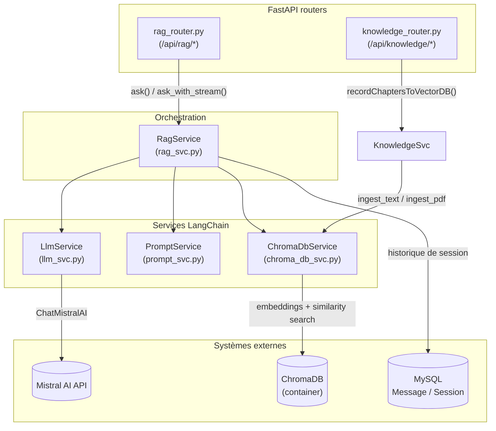
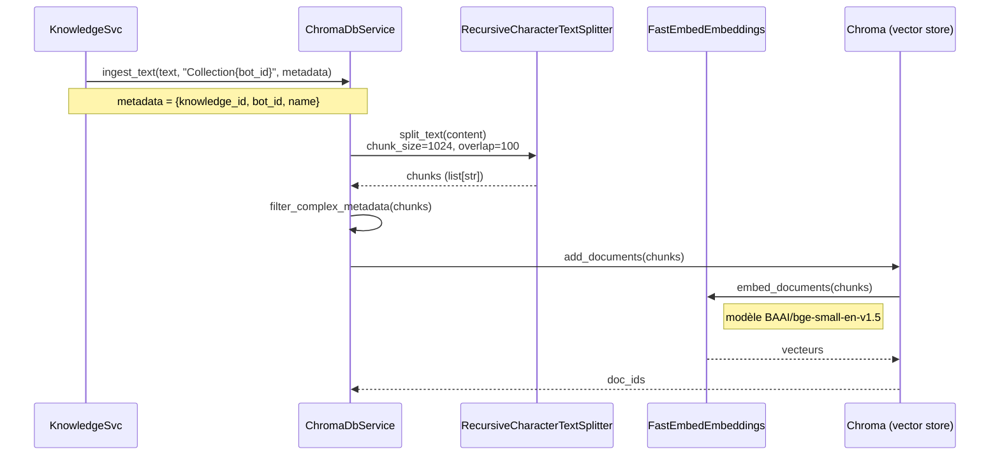
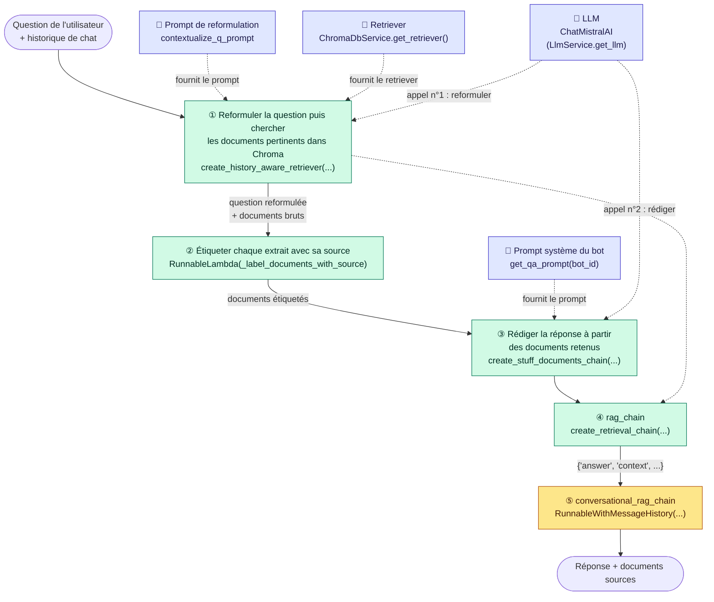
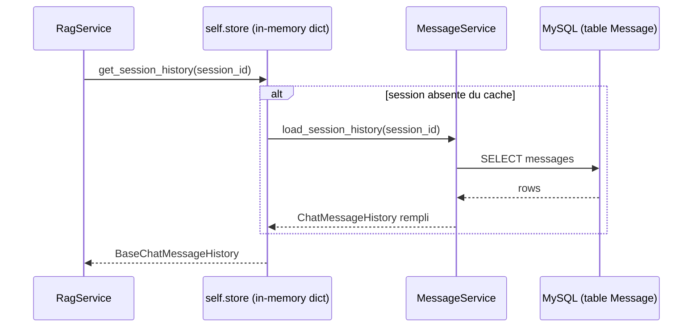
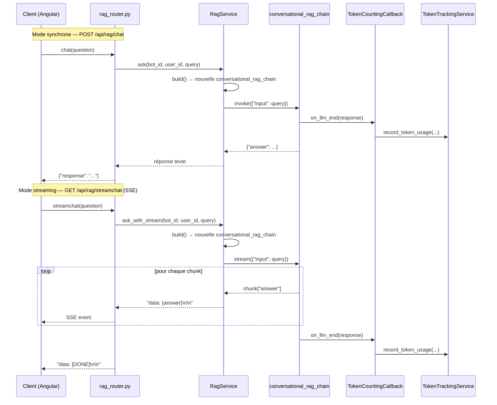
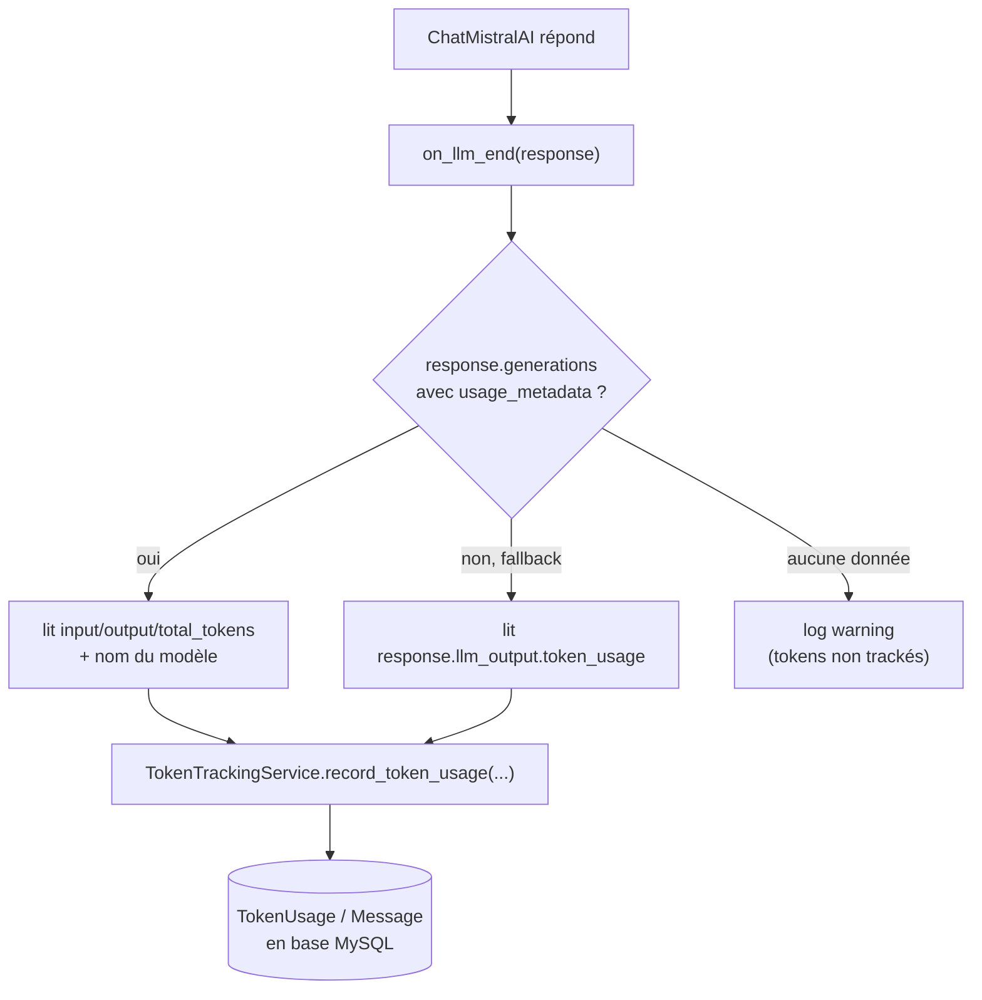

# Utilisation de LangChain dans Bot Factory

Ce document décrit où et comment [LangChain](https://python.langchain.com/) est utilisé côté
serveur, du chargement des documents jusqu'à la réponse du bot (avec ou sans streaming), en
passant par le suivi des tokens.

LangChain n'intervient que dans 4 services, tous dans `server/ai_server/services/` :

| Service | Rôle | Composants LangChain utilisés |
|---|---|---|
| `chroma_db_svc.py` | Ingestion et recherche vectorielle | `Chroma`, loaders de documents, text splitters, `FastEmbedEmbeddings` |
| `prompt_svc.py` | Construction des prompts | `ChatPromptTemplate`, `MessagesPlaceholder` |
| `llm_svc.py` | Accès au LLM + tracking tokens | `ChatMistralAI`, `BaseCallbackHandler` |
| `rag_svc.py` | Orchestration (chaînes RAG) | `create_history_aware_retriever`, `create_retrieval_chain`, `create_stuff_documents_chain`, `RunnableWithMessageHistory`, `RunnableLambda` |

Le seul fournisseur LLM réellement branché aujourd'hui est **Mistral AI** (`ChatMistralAI`).
`llm_svc.py` importe encore `langchain_community.llms.Ollama` mais ne l'instancie nulle part —
import mort, à considérer comme tel plutôt que comme un second provider actif.

---

## 1. Vue d'ensemble des composants

---

## 2. Ingestion : du document texte/PDF aux vecteurs

Déclenchée quand une connaissance est créée/modifiée (`KnowledgeSvc._ingest_knowledge_node`)
ou en masse via `POST /api/rag/transmit_to_alfred/{bot_id}` (`recordChaptersToVectorDB`).

Points clés :
- Chaque chunk est taggué avec `knowledge_id` / `bot_id` / `name` dans ses métadonnées Chroma,
  ce qui permet de le retrouver et de le supprimer individuellement lors d'une resynchronisation
  (`sync_knowledge_to_vector_db`) sans devoir vider toute la collection du bot.
- Une collection ChromaDB par bot : `f"Collection{bot_id}"`.
- Les PDF passent d'abord par `PyPDFLoader` avant le même découpage/embedding.

---

## 3. Construction de la chaîne RAG (`RagService.build`)

À chaque question, `RagService.build(bot_id, user_id, session_id)` **reconstruit et retourne**
une nouvelle chaîne conversationnelle — elle n'est jamais mise en cache ni stockée sur `self` :
`RagService` est un singleton partagé entre requêtes concurrentes, et chaque appel a besoin de
son propre `TokenCountingCallback` (lié à ce `user_id`/`bot_id`/`session_id`) attaché au LLM, donc
réutiliser une chaîne stockée sur l'instance risquerait de mélanger le tracking de tokens de deux
requêtes simultanées. C'est `build()` elle-même qui orchestre les 5 étapes ; chacune est déléguée
à une méthode privée dédiée (`_build_history_aware_retriever`, `_build_answer_chain`,
`_build_retrieval_chain`, `_wrap_with_history`) qui porte le même nom que l'étape du schéma :

Le diagramme ci-dessous suit l'ordre dans lequel **une question traverse réellement le pipeline**
au moment de `.invoke()` / `.stream()` — c'est cet ordre d'exécution qui rend la construction
compréhensible, plus que l'ordre des lignes de code qui assemblent les objets.

Ce qu'il faut retenir de ce schéma :

- **① `create_history_aware_retriever`** : reçoit la question brute + l'historique, demande au
  LLM de la reformuler en question autonome (évite les questions ambiguës du type "et pour lui ?"),
  puis interroge le retriever Chroma avec cette question reformulée. C'est le **1ᵉʳ des deux appels
  LLM** de la chaîne.
- **② `RunnableLambda`** : étape custom (pas un composant LangChain standard) qui préfixe chaque
  extrait récupéré par `Source: <nom du chapitre>`, à partir des métadonnées Chroma — uniquement
  pour la traçabilité affichée dans le prompt, jamais pour instruire le modèle (voir la note
  anti-prompt-injection dans `prompt_svc.py::update_prompt`).
- **③ `create_stuff_documents_chain`** : "stuff" (empile) tous les documents étiquetés dans le
  prompt système du bot (`{context}`), puis appelle le LLM une **2ᵉ fois** pour rédiger la réponse
  finale. Pas de map-reduce/refine — adapté à un petit nombre de chunks.
- **④ `create_retrieval_chain`** : assemble simplement les étapes ① et ③ en une seule chaîne
  (`rag_chain`), qui expose la réponse sous `answer` et les documents sous `context`.
- **⑤ `RunnableWithMessageHistory`** : enveloppe `rag_chain` pour lire/écrire automatiquement
  `chat_history` avant/après chaque appel, via `get_session_history(session_id)` (§4). C'est
  cette version finale, `conversational_rag_chain`, qui est réellement invoquée par `ask()` et
  `ask_with_stream()`.

Le LLM est donc appelé **deux fois par question** : une fois pour reformuler (étape ①), une fois
pour rédiger la réponse (étape ③) — chacun des deux appels déclenche indépendamment le
`TokenCountingCallback` (§6).

---

## 4. Historique de conversation

`get_session_history` maintient un cache en mémoire (`self.store: dict`) de
`BaseChatMessageHistory` par `session_id`, initialisé depuis MySQL via `MessageService` au
premier accès (`load_session_history`) :

⚠️ Les deux points d'entrée du chat n'utilisent pas la même clé de session :
- `ask()` (chat non-streamé) invoque la chaîne avec `session_id = f"{bot_id}_{user_id}"`.
- `ask_with_stream()` (SSE) invoque la chaîne avec `session_id = f"Collection{bot_id}"`
  (le nom de la collection Chroma, sans le `user_id`).

Chaque chemin a donc sa propre entrée dans `self.store`/l'historique en mémoire process ; c'est
un détail d'implémentation existant à garder en tête si l'historique semble "sauter" en passant
du mode streamé au non-streamé.

---

## 5. Deux modes d'appel : synchrone et streaming (SSE)

Dans les deux cas, la question de l'utilisateur et la réponse finale du bot sont persistées via
`MessageService.save_message` (rôles `"user"` / `"assistant"`).

---

## 6. Suivi automatique des tokens (`TokenCountingCallback`)

`LlmService.get_llm(user_id, bot_id, session_id)` attache un `BaseCallbackHandler` LangChain
(`TokenCountingCallback`) à une instance dédiée de `ChatMistralAI` dès que `user_id`/`bot_id`
sont connus. LangChain invoque `on_llm_end` après chaque appel au modèle :

C'est le mécanisme documenté dans `CLAUDE.md` : **il ne faut jamais créer de compte de tokens
manuellement** en passant par `rag_svc` — le callback s'en charge automatiquement à chaque appel LLM.

---

## 7. Fichiers à connaître

- `server/ai_server/services/rag_svc.py` — assemblage des chaînes, `ask()`, `ask_with_stream()`
- `server/ai_server/services/llm_svc.py` — instanciation `ChatMistralAI`, `TokenCountingCallback`
- `server/ai_server/services/prompt_svc.py` — `ChatPromptTemplate` (reformulation + prompt système du bot)
- `server/ai_server/services/chroma_db_svc.py` — ingestion, embeddings, retriever Chroma
- `server/ai_server/services/knowledge_svc.py` — déclenche l'ingestion à partir des connaissances
- `server/ai_server/services/token_tracking_svc.py` — persistance des tokens consommés
- `server/ai_server/routers/rag_router.py` — endpoints `/api/rag/*` (chat, streamchat, historique)
